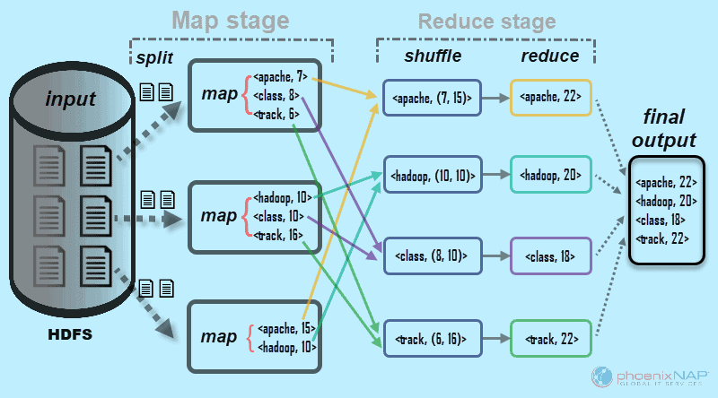
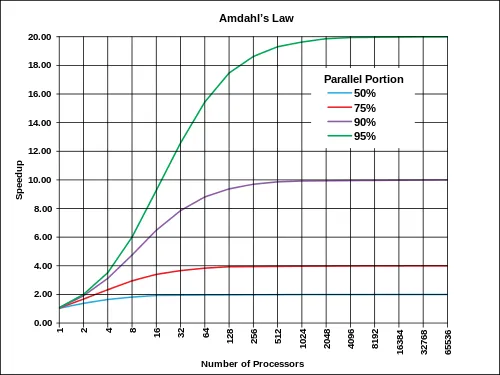

# 1. 동시성과 병렬성
1.1. ~ 1.3. 프로세스, 동시성, 병렬성
- 프로세스는 계산을 실행하는 주체
- Context 관리 하는 실행의 최소 단위

## 3.1 테스크 병렬성 (스레드 병렬성)
여러 태스크(프로세스)가 동시에 실행되는 것을 의미

* | 구분        | 병렬성 (Parallelism)       | 동시성 (Concurrency)               |
  | --------- | ----------------------- | ------------------------------- |
  | **정의**    | **여러 작업을 동시에 실행**       | **여러 작업을 번갈아가며 처리**             |
  | **핵심 개념** | **동시에 실행됨**             | **동시에 진행되는 것처럼 보임**             |
  | **전제 조건** | 보통 **멀티코어** 필요          | **단일 코어도 가능**                   |

## 3.2 데이터 병렬성
데이터를 여러 개로 나눠서 병렬로 처리하는 경우


* 암달의 법칙


## 3.3
* 인스트럭션 레벨 병렬성
* 

* 1.4. 동시 처리와 병렬 처리

# 2. 프로그래밍 기본
- infix notation  :  `x0 = x1 + x2`
- Assembly : `add x0 x1 x2`

Assembly는 prefix notation과는 비슷하게, 연산자(nmemonic)을 선두로 두고 이하를 표기한다.

* Assembly 구조
`68 73 9D 00 01`
`PUSH 0x01009D73`
68 : Operation Code
68, 73, 9D, 00, 01 : Machine Code
PUSH : mnemonic

## 2.1 Pthreads

```c
#include <pthread.h>
#include <stdio.h>
#include <stdlib.h>
#include <unistd.h>

// 스레드 함수
void* thread_func(void* arg) {
    int num = *(int*)arg;
    printf("Thread %d is running.\n", num);
    sleep(1); // simulate work
    printf("Thread %d is exiting.\n", num);
    return NULL;
}

int main() {
    pthread_t tid;
    pthread_attr_t attr;
    int thread_num = 1;

    // 1. 스레드 속성 초기화
    if (pthread_attr_init(&attr) != 0) {
        perror("pthread_attr_init");
        exit(1);
    }

    // 2. detach 상태로 설정 (join 불필요)
    if (pthread_attr_setdetachstate(&attr, PTHREAD_CREATE_DETACHED) != 0) {
        perror("pthread_attr_setdetachstate");
        exit(1);
    }

    // 3. 스레드 생성 (속성 포함)
    if (pthread_create(&tid, &attr, thread_func, &thread_num) != 0) {
        perror("pthread_create");
        exit(1);
    }

    // 4. 스레드 속성 해제
    pthread_attr_destroy(&attr);

    printf("Main thread: created detached thread %lu\n", tid);

    // detached 상태이므로 join하지 않음
    sleep(2);  // 자식 스레드가 종료되기 전에 main이 끝나지 않게

    printf("Main thread exiting.\n");
    return 0;
}

```
| 단계                                                             | 설명                                                         |
| -------------------------------------------------------------- | ---------------------------------------------------------- |
| `pthread_attr_t attr;`                                         | 스레드 속성을 저장할 객체                                             |
| `pthread_attr_init(&attr);`                                    | 기본 속성으로 초기화                                                |
| `pthread_attr_setdetachstate(&attr, PTHREAD_CREATE_DETACHED);` | **detach 상태** 설정<br>스레드가 종료되면 자동으로 자원 반환됨 (따로 join 안 해도 됨) |
| `pthread_create(..., &attr, ...);`                             | 지정한 속성을 적용하여 스레드 생성                                        |
| `pthread_attr_destroy(&attr);`                                 | 속성 객체는 더 이상 필요 없으므로 해제                                     |


프로세스 메모리 레이아웃 (간단화)
┌──────────────┐  높은 주소
│   커널 영역   │
├──────────────┤
│   힙(Heap) │ ↑ 동적 할당 (malloc, new 등)
│              │
│              │
│              │
│              │
│              │
│    Stack     │ ↓ 함수 호출 시 프레임 추가
├──────────────┤
│   코드(Code)  │
│   데이터(Data) │
└──────────────┘  낮은 주소


## 2.2. Volatile
컴파일러의 최적화를 억제한 메모리 접근을 구현하기 위한 수식자

- 기존의 컴파일러는 레지스터에 복사한 값을 이용함
  - 이는, 메모리 접근보다 레지스터 접근이 빠르기 때문
- 그러나, 메모리상의 값을 감시하는 경우 이 최적화는 장애가 되는 경우가 많음

```c
void wait_while_0(int *p) {
    while (*p == 0) {}
}

```
* Volatile이 없을 때
```asm
wait_while_0:
    ldr w8, [x0]      ; [1] 메모리 읽음
    cbz w8, .LBB0_2   ; [2] 0이면 무한 루프 점프
    ret
.LBB0_2:
    b .LBB0_2         ; [3] 무한 루프지만 메모리 재접근 없음!
```
- *p가 0일 경우 한 번만 읽고 이후에는 메모리에 다시 접근하지 않고 무한 루프 진입
-  컴파일러가 메모리 값이 변하지 않는다고 가정하고 루프 내부에서 재접근 제거

- Loop Invariant Code Motion의 결과
  - 참고: https://www.cs.cmu.edu/afs/cs/academic/class/15745-s19/www/lectures/L9-LICM.pdf
* Volatile을 명시한 경우
```asm
wait_while_0:
  .LBB0_1:
  ldr w8, [x0]       ; [1] 매 루프마다 메모리 읽음
  cbz w8, .LBB0_1    ; [2] 값이 0이면 다시 읽음
  ret
```
- volatile 때문에 컴파일러가 매번 메모리에서 값을 읽어야 한다고 판단 
  - 이로 인해 루프 내부에서 메모리 재접근이 억제되지 않고 보장

* 결론
- volatile은 "이 변수는 언제든 외부 요인에 의해 바뀔 수 있다"고 명시
  - 따라서 컴파일러가 최적화를 하지 못하게 막음

``` c
volatile int done = 0;

// Thread A
while (done == 0) {}

// Thread B
done = 1;
```