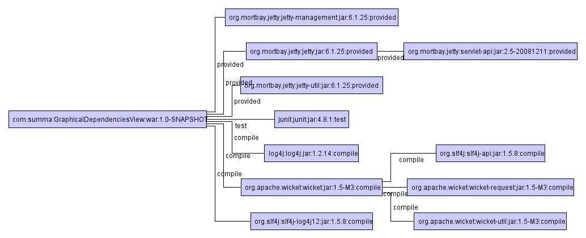

# 1. 의존성이란 무엇인가?
> 목표: ‘의존성’이라는 개념을 코드, 시스템, 빌드 단위로 명확하게 정의한다.

### 정의
- 어떤 컴포넌트가 다른 컴포넌트의 기능, 데이터, 또는 실행 결과에 직접적 혹은 간접적으로 의존하는 관계

### 의존성 레벨
| 관점             | 설명                       | 예시                    |
| -------------- | ------------------------ | --------------------- |
| **코드 레벨**      | 코드 작성 시 나타나는 의존성         | `import`, 메서드 호출      |
| **JVM/시스템 레벨** | 클래스를 로딩하고 실행할 때 생기는 의존성  | 클래스 경로, ClassLoader   |
| **빌드 레벨**      | 컴파일/패키징 단계에서 필요한 외부 구성요소 | Maven/Gradle의 선언적 의존성 |

→ 빌드 레벨 : 4장에서 상세 설명 예정
### 의존성 분류
| 분류 기준   | 종류           | 설명                 | 예시                    |
| ------- | ------------ | ------------------ | --------------------- |
| **시간**  | Compile-time | 컴파일 시점에 필요한 것      | Lombok, JPA 인터페이스     |
|         | Runtime      | 실행 시점에만 필요한 것      | JDBC 드라이버             |
| **형태**  | Direct       | 내가 직접 명시한          | `org.apache.commons`  |
|         | Transitive   | 의존한 라이브러리가 또 의존한 것 | Spring → Jackson      |
| **스코프** | Provided     | 런타임에는 환경에서 제공됨     | Servlet API in Tomcat |
|         | Test         | 테스트 시점에만 필요        | JUnit, Mockito        |
→ Transitive Dependency : 4장에서 상세 설명 예정
- Transitive 의존성이란, 의존성의 의존성을 말합니다. 
- 만약 a가 b를 참조하고, b가 c를 참조한다면, a는 c를 transitive 의존성으로 간주합니다.


### 해결해야 할 의존성 문제
| 문제         | 예시               | 증상                              |
| ---------- | ---------------- | ------------------------------- |
| 버전 충돌      | SLF4J vs Logback | ClassNotFoundException          |
| 중복 로딩      | 두 JAR에 같은 클래스    | ClassCastException              |
| 의도되지 않은 동작 | 의존성이 Shadowing됨  | 다른 버전의 함수 호출됨                   |
| 빌드 실패      | 선언 누락            | Compile Error, Symbol not found |


### 보완, Transitive Dependency 작동 개요
```<!-- 내가 선언한 라이브러리 -->
<dependency>
  <groupId>com.foo</groupId>
  <artifactId>foo-core</artifactId>
  <version>2.0</version>
</dependency>
```
<!-- foo-core 내부 -->
foo-core → bar-utils (1.1) → commons-logging (1.0)


🔄 Maven/Gradle의 기본 탐색 구조
- Depth-first + 버전 우선 순위
  - mvn dependency:tree 명령을 이용하여, 의존성 정보를 쉽게 확인할 수 있습니다.
    [출처] Maven 사용자라면 이 정도는 알아야지, 오영은|작성자 개발자센터

- Gradle은 nearest 우선 (루트에서 가까운 것)
- Maven은 dependency resolution rules + dependencyManagement 우선


* 출처
  - https://blog.naver.com/naverdev/120113627296