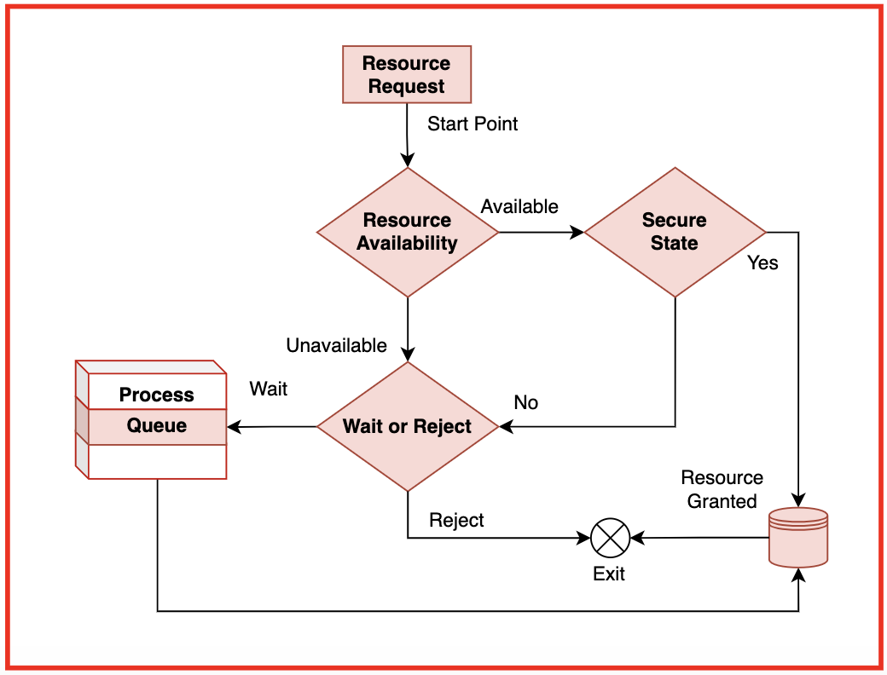

# 3. Bankers Algorithm

- Deadlock을 회피하기 위한 알고리즘

## 3.1. `is_safe` 함수
- 대출 가능한 리소스와 대출을 시뮬레이션



```
1. Let Work and Finish be vectors of length 'm' and 'n' respectively. 
    Initialize: Work = Available 
    Finish[i] = false; for i=1, 2, 3, 4....n
2. Find an i such that both 
     2.1 Finish[i] = false 
     2.2 Needi <= Work 
     if no such i exists goto step (4)
3. Work = Work + Allocation[i] 
    Finish[i] = true 
    goto step (2)
4. if Finish [i] = true for all i 
    then the system is in a safe state 
```

```
topological_sort(G):
    while there exists node with in_degree = 0:
        pick such node
        remove node and its outgoing edges
    if all nodes removed: success
    else: cycle detected
```

(진행 가능한 것부터 순차적으로 수행한다)