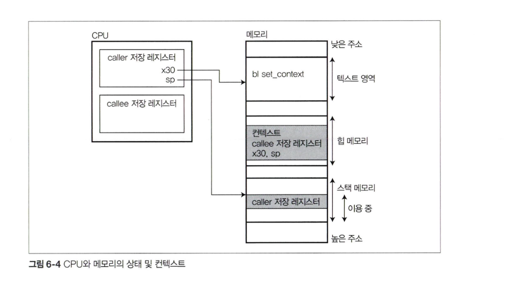

# 2. Implementing Cooperative Green Thread
## 2.2 Context



##  `set_context()`의 역할: Caller vs Callee

- 유저 수준의 스레드나 코루틴에서 컨텍스트를 저장할 때는 보통 `set_context()`와 같은 함수가 사용.

| 구분 | 동작 방식 |
|------|------------|
| **Caller (`set_context()`를 호출하는 쪽)** | 레지스터 상태가 **스택에 저장되지 않고 회피됨** |
| **Callee (`set_context()` 자체)** | 레지스터 상태를 **힙에 할당된 영역에 저장**하여, 나중에 복원 가능하도록 함 |

- 반환값을 활용해 어느 쪽(레지스터 저장, 돌아올 때)에서 돌아왔는지 판별해야 함

이러한 구분은 **일시적인 스택 프레임 저장**과 **지속적인 힙 기반 저장**을 명확히 나누는 목적이 있습니다.

## `switch_context()` 의 의미
- 컨테스트 스위칭이 일어남.


## 컨텍스트 스위칭 - Caller

```
caller() {
...
switch_context(&prev_ctx, &next_ctx);
...
}
```
```
switch_context(prev, next) {
    if (set_context(prev) == 0) {
        jump_to(next); // longjmp 나 setjmp같은 역할. unsafe함
    }
}
```

| 단계 | 함수                           | Caller의 역할 | Callee의 역할           |
| -- | ---------------------------- | ---------- | -------------------- |
| ①  | `switch_context(prev, next)` | 전환 요청      | -                    |
| ②  | `set_context(prev)`          | 저장 요청 호출   | 레지스터/스택을 **힙에 저장**   |
| ③  | `jump_to(next)`              | -          | **컨텍스트 복원 후** return |
| ④  | `set_context()` 복귀           | -          | return 값 ≠ 0 → 흐름 계속 |

---

## 6.2.3. 스레드 생성, 파기, 스케줄링
- `schedule()`
  - 실행 중인 스레드를 정지
  - 실행 큐에 있는 다음 스레드로 컨텍스트 스위칭
  ```
  if (set_context(regs)==0) switch_context(next);
  ```
- `spawn()`
  - 실제 스레드용 함수의 호출 및 종료 후 후처리하기 위한 함수
- `rm_unused_stack()`
  - 스택 영역의 가드 페이지 삭제, 스택 영역 해제
  - 

---
## 정리
`set_context()`는 호출자와 피호출자의 역할을 분리함으로써,  
안전하고 효율적인 사용자 수준의 컨텍스트 전환을 가능하게 만듭니다.