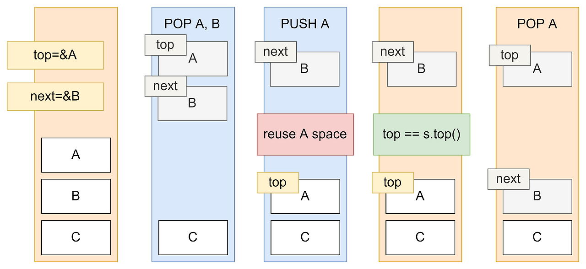

# 3. 락프리 데이터 구조와 알고리즘
> 배타락을 이용하지 않고 데이터를 수행하는 데이터 구조 및 조작 알고리즘

## 0. Use-Case
- 기존 배타락을 사용하면 성능이 매우 떨어지는 경우 
  - Context Switching으로 인한 퍼포먼스 저하 예상시
  - 커널모드까지 진입 시

## 1. 락프리 스택
- IncompleteLockFreeStack에서 `push()`, `pop()` 구현
- 링크드 리스트 구조를 활용한 스택과 같음
- CAS 조작을 이용해 atomic하게 수행하므로 배타락을 이용하지 않고 데이터 공유 및 업데이트

## 2. ABA 문제

- 가정 : 파란색 스레드가 주황색 스레드보다 처리속도가 빠르다
- 시나리오 : 주황색(느린) 스레드가 A를 pop, 파란색 스레드가 A, B를 pop, A를 push
- 파란색 스레드 : pop A -> pop B -> push A 시, A를 재사용
- 주황색 스레드 시점 : pop A 후 B를 top하려 하는데, 스택을 쓰면 오류 발생
  - memory validation error 발생

- 발생 사유: 업데이트 유무를 CAS 처리에 의한 값 비교로 수행
  - LL/SC를 이용하여 락 프리 스택을 구현하면 해결 가능
  - 메모리에서 값을 읽고, 그 값을 링크로 설정. 이를 감시

## 3. 멀티스레드 참조에 관한 문제
- 시나리오 
  - 스레드 1: stack.top을 참조 (읽고 있음)
  - 스레드 2: stack.pop() 실행 → stack.top이 가리키는 노드를 제거 (메모리 해제 또는 반환)

결과
- 스레드 1은 여전히 해당 노드를 가리키고 있는데, 스레드 2가 그 노드를 삭제했다면?
    → dangling pointer (죽은 포인터) 발생 가능.
- 스레드 1이 해당 노드에 접근하면, use-after-free, segfault, 또는 undefined behavior 발생. 
- lock-free 자료구조에서 자주 등장하는 메모리 안전성 문제

### 4. 락프리 종류
-